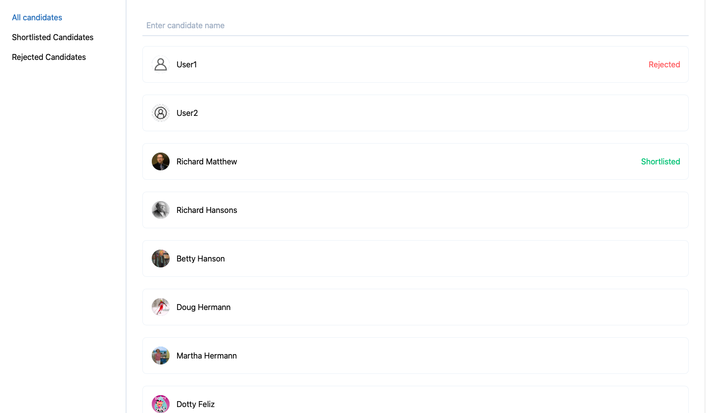
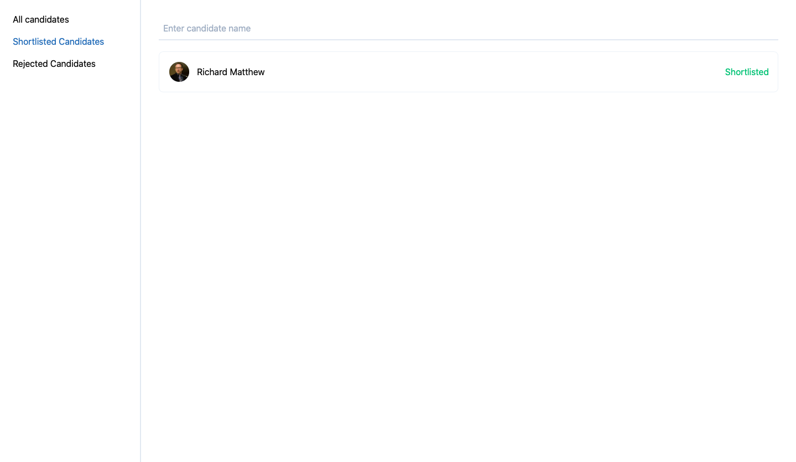
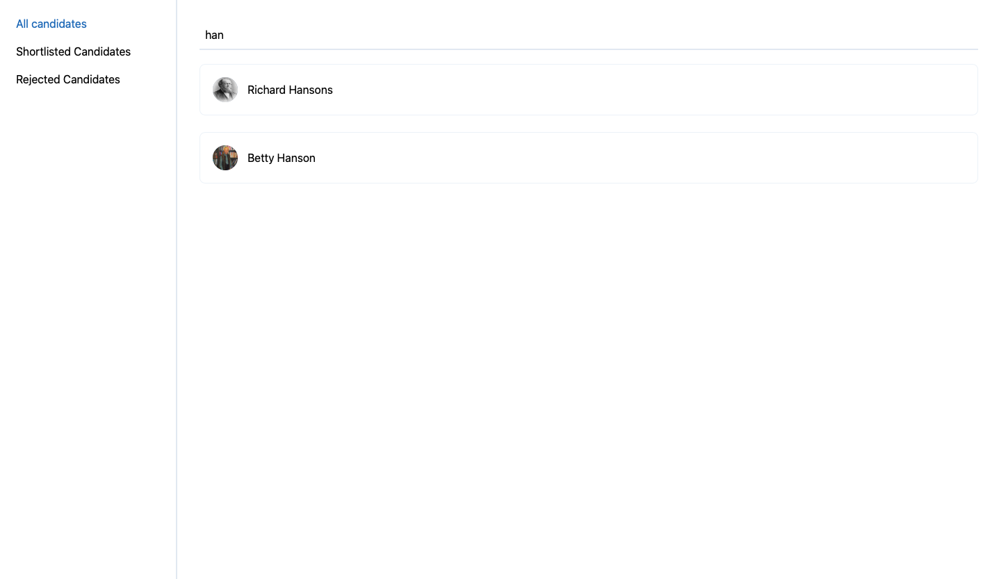

This project is bootstrapped with [Create React App](https://github.com/facebookincubator/create-react-app) with added support for Typescript and Tailwind CSS

## Screenshots





## Folder Structure

After creation, your project should look like this:

```
my-app/
  public/
    index.html # base html structure
    favicon.ico # react icon
    manifest.json # manifest file
  screenshots/ # app screenshots
  src/
    components/
      CandidateDetails.tsx # component rendered on candidate details page
      CandidateList.tsx # component to show candidate list
      CandidateRow.tsx # component for candidate UI
      CandidateSearch.tsx # component for candidate search
    App.css # main app css file
    App.tsx # main app tsx file
    index.css # index css file
    index.tailwind.css # tailwind css file
    index.tsx # index tsx file 
    react-app-env.d # ts file
    registerServiceWorker # service worker
  .gitignore # gitignore file
  package.json # package manager file
  README.md # this file
  tailwind.config.js # tailwind config file
  tsconfig.json # typescript config file
  yarn.lock # yarn lock file
```

## Available Scripts

In the project directory, you can run:

### `npm start`

Runs the app in the development mode.<br>
Open [http://localhost:3000](http://localhost:3000) to view it in the browser.

The page will reload if you make edits.<br>
You will also see any lint errors in the console.

### `npm run build`

Builds the app for production to the `build` folder.<br>
It correctly bundles React in production mode and optimizes the build for the best performance.

The build is minified and the filenames include the hashes.<br>
Your app is ready to be deployed!

See the section about [deployment](#deployment) for more information.

### `npm run eject`

**Note: this is a one-way operation. Once you `eject`, you can’t go back!**

If you aren’t satisfied with the build tool and configuration choices, you can `eject` at any time. This command will remove the single build dependency from your project.

Instead, it will copy all the configuration files and the transitive dependencies (Webpack, Babel, ESLint, etc) right into your project so you have full control over them. All of the commands except `eject` will still work, but they will point to the copied scripts so you can tweak them. At this point you’re on your own.

You don’t have to ever use `eject`. The curated feature set is suitable for small and middle deployments, and you shouldn’t feel obligated to use this feature. However we understand that this tool wouldn’t be useful if you couldn’t customize it when you are ready for it.